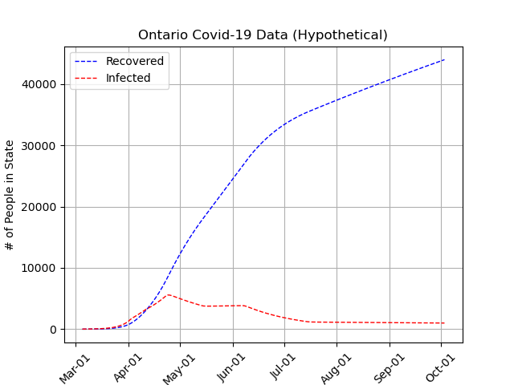

# Covid-Extrapolator
An extrapolation algorithm to predict future cases and recoveries. The model predicted the data with 85% accuracy. Here is official [Ontario reports](https://covid-19.ontario.ca/covid-19-epidemiologic-summaries-public-health-ontario).

